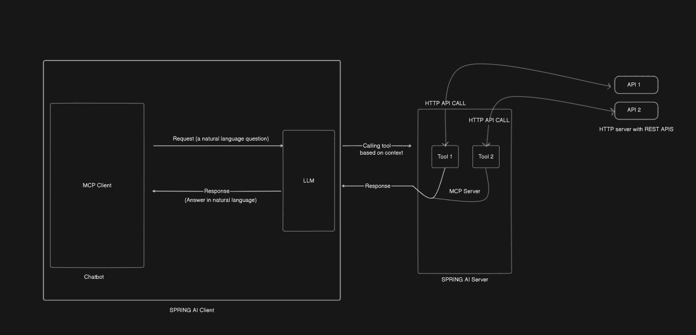

MCP Server – Spring AI Gadgets API
-----------------------------------

This project implements an MCP (Model Context Protocol) server using Spring AI (Java).
It provides tools that allow LLMs and MCP clients to interact with gadgets from the RESTful API demo service
.

Available tools:
------------------

1. getAllGadgets: gets all the gadgets available in the repository

2. addGadget: adds a new Gadget object via REST API

3. updateGadget: updates an existing Gadget object by id via REST API

4. getSpecificGadget: gets a specific gadget based on the id

Architecture:
--------------
Spring Boot + Spring AI for building the MCP server

MCP protocol for client-server communication

External API: https://restful-api.dev/
used as the gadget datasource

Running the solution:
-----------------------
Assuming Docker desktop, Maven, Java (jdk 21) are already installed, follow below steps to run the project.

Open cmd or powershell and then navigate to the root folder of the project.

1. Enter the below commands in order

    1. `mvn clean package` - builds the whole maven package and generates a .jar file under target folder.

    2. `docker build -t mcp-server .` - Builds the docker image to generate container.

    3. ` docker run -d -p 8080:8080 mcp-server` - Runs the container generated by last command.

    4. Open the postman and on a new tab -> choose MCP option to hit the MCP server
       1. hit `http://localhost:8080/sse`
       2. Select whichever tool that is of the interest and then hit "connect" and then "run"
          
       for ex: for adding a new gadget use 
       ```json 
       {
         "method": "tools/call",
         "params": {
         "name": "addGadget",
         "arguments": {
         "gadget": {
         "id": "",
         "name": "Apple MacBook Pro 18",
         "data": {
         "year": 2019,
         "price": 1849.99,
         "CPU model": "Intel Core i9",
         "Hard disk size": "1 TB"
       } } } } }
          
    
Architecture diagram - (MCP Client with LLM and MCP Server with an external API server)
------------------------------
